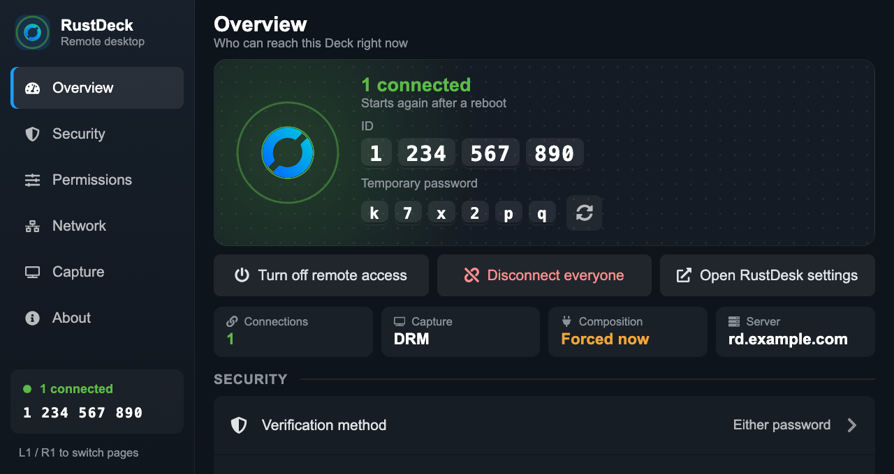
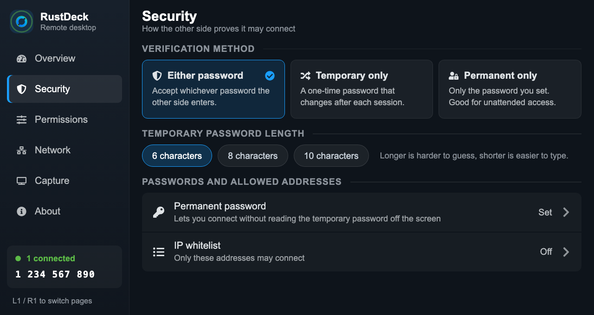
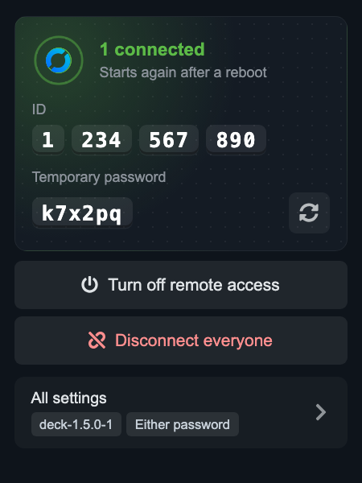
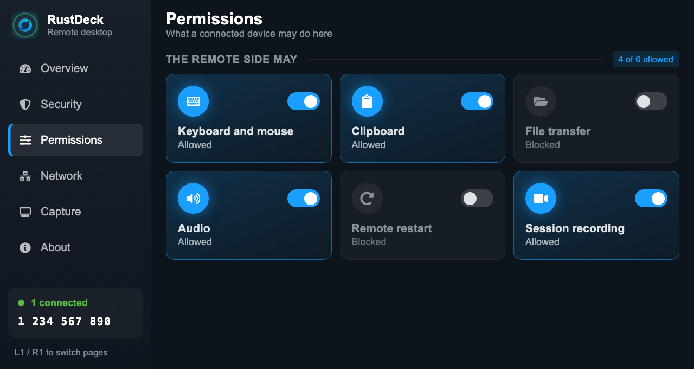
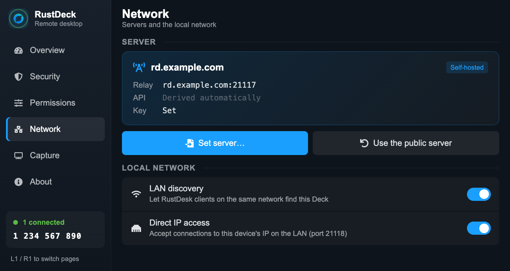
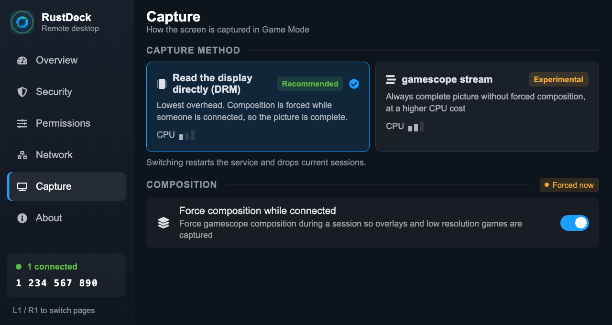
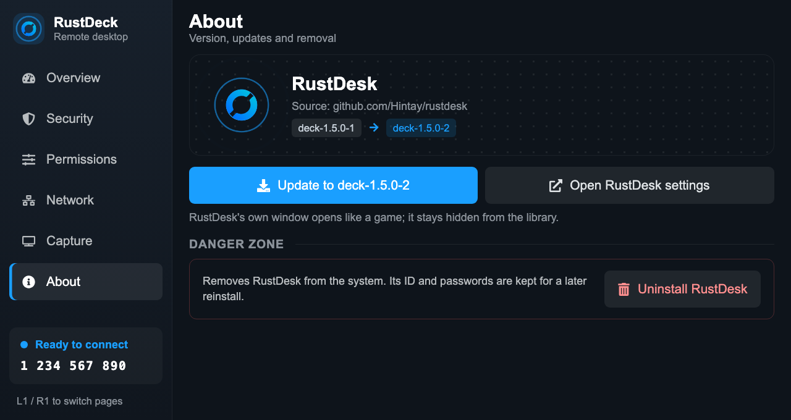

# RustDeck

A [Decky Loader](https://github.com/SteamDeckHomebrew/decky-loader) plugin that runs [RustDesk](https://github.com/rustdesk/rustdesk) on the Steam Deck in Game Mode, so other devices can see and control the Deck while you play, with no keyboard or desktop session needed on the Deck itself.



| Security | Quick access panel |
| --- | --- |
|  |  |

| Permissions | Network |
| --- | --- |
|  |  |

| Capture | About |
| --- | --- |
|  |  |

## Features

- **One-press install** — downloads a RustDesk build made for the Deck (see [RustDesk build](#rustdesk-build)), checks its SHA-256 and installs it without touching the read-only system image. Updates and removal work the same way.
- **Quick access panel** — whether RustDesk is waiting or someone is connected, the ID and temporary password, a new password on demand, remote access on/off and *Disconnect everyone*.
- **Full-screen settings** — L1/R1 switch between:
  - **Overview**: status, ID and password, connections, capture method, composition state and server at a glance.
  - **Security**: verification method (temporary, permanent or either), temporary password length, permanent password, IP whitelist. Warns when only a permanent password is accepted but none is set, which would lock everyone out.
  - **Permissions**: what a connected device may do (keyboard and mouse, clipboard, file transfer, audio, remote restart, session recording).
  - **Network**: import a self-hosted server's configuration string or go back to the public servers, LAN discovery, direct IP access.
  - **Capture**: DRM capture (default) or gamescope's screen stream (experimental), and forced composition while connected.
  - **About**: version, update check, opening RustDesk's own window, uninstall.
- **RustDesk's own window** — opens in Game Mode through a non-Steam shortcut the plugin creates. The shortcut is hidden from the library, gets RustDesk artwork, and starts RustDesk in Steam's UI language.
- **Starts with the Deck** — with remote access on, RustDesk comes back after a reboot. Reloading the plugin does not drop a session.
- **Gamepad first** — every page is navigable with the d-pad.

## Requirements

- A Steam Deck running SteamOS 3 in Game Mode (developed on SteamOS 3.8). Desktop Mode is not handled by the plugin.
- [Decky Loader](https://github.com/SteamDeckHomebrew/decky-loader). The plugin runs its backend as root, which it needs to install RustDesk and run its service.
- Internet access to GitHub for installing and updating RustDesk (about 25 MB).

## Install

1. Download the plugin zip from the latest [release](https://github.com/Hintay/decky-rustdeck/releases).
2. In Decky, turn on *Settings → General → Developer mode*.
3. Open *Settings → Developer → Install Plugin from ZIP File* and pick the zip.
4. Open RustDeck in the quick access menu and press *Install RustDesk*, then turn on remote access.

To connect, open RustDesk on another device and enter the ID and password shown in the plugin.

## How it works

- **Install**: SteamOS's root file system is read-only and `/var` is small, so RustDesk is installed as a [systemd-sysext](https://www.freedesktop.org/software/systemd/man/latest/systemd-sysext.html) extension stored in `/home/.rustdeck` and merged over `/usr`. SteamOS does not merge extensions at boot, so the plugin merges it again when Decky starts.
- **Service**: RustDesk runs as a transient systemd unit, `rustdeck-rustdesk`: a root `--service` that starts the `--server` in the `deck` user's session.
- **Capture**: frames are read straight from the display (DRM/KMS) and encoded with VA-API. gamescope often scans games out directly without compositing, and such frames miss overlays and run at the game's own resolution. While someone is connected, the plugin therefore forces gamescope to composite and turns that off again afterwards. A setting you turned on yourself in Steam's developer menu is left alone.
- **Input**: gamescope ignores absolute pointer devices, so mouse and keyboard input goes through gamescope's EIS socket (libei).
- **Passwords**: the permanent password is handed to RustDesk over its local IPC socket, never on a command line, where it would show up in the process list and logs.

## RustDesk build

The plugin installs `rustdesk-unattended-wayland` from the `deck-*` releases of [Hintay/rustdesk](https://github.com/Hintay/rustdesk/releases). It is RustDesk with DRM/KMS capture and fixes for the Deck that are on their way upstream:

- size a plane-rotated scanout correctly (the Deck's panel is mounted rotated); proposed as [rustdesk/rustdesk#16444](https://github.com/rustdesk/rustdesk/pull/16444)
- mouse input through gamescope's EIS, and a cursor at gamescope's size
- keep gamescope's screen stream when it reports no size
- no tray icon under gamescope, where it crashed the `--server` in a loop

## Known limitations

- After a click, gamescope shows its own cursor on the Deck until the mouse has been still for about three seconds.
- Games that turn the camera with the mouse need relative mouse mode, which RustDesk clients do not offer for Linux peers. The camera spins instead.
- Video is encoded at about 30 fps.
- The gamescope stream capture is experimental and uses more CPU than DRM capture.

## Uninstall

*About → Uninstall RustDesk* stops RustDesk and removes it from the system. Uninstalling the plugin does the same. RustDesk's own configuration, with its ID and passwords, is kept, so a reinstall keeps the same ID.

## Development

```bash
pnpm install
pnpm run build
pnpm run typecheck
```

`pnpm run package` assembles the installable zip in `out/` from the current build. Pushing a `v*` tag (for example `v0.1.0`) runs CI and publishes that zip as a GitHub release, with notes generated from conventional commits.

`scripts/deploy.sh [root@steamdeck.local]` builds the plugin and copies it to a Deck over SSH as root, restarting Decky. `scripts/make-artwork.py` regenerates the Steam artwork in `assets/artwork/` (needs Pillow).

## License

Copyright (C) 2026 Hintay

Released under the [GNU Affero General Public License v3.0](LICENSE) or any later version.

- RustDesk's logo and the artwork made from it come from [rustdesk/rustdesk](https://github.com/rustdesk/rustdesk) (AGPL-3.0). RustDesk is a trademark of its owners; this project is not affiliated with RustDesk.
- Parts of the build setup come from the [Decky plugin template](https://github.com/SteamDeckHomebrew/decky-plugin-template), under the [BSD 3-Clause License](LICENSES/BSD-3-Clause-decky-template.txt).
